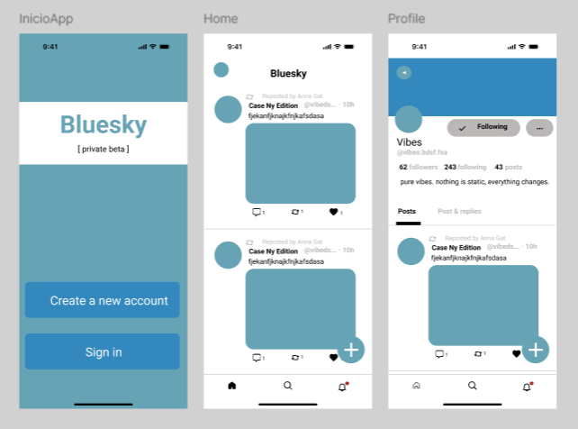
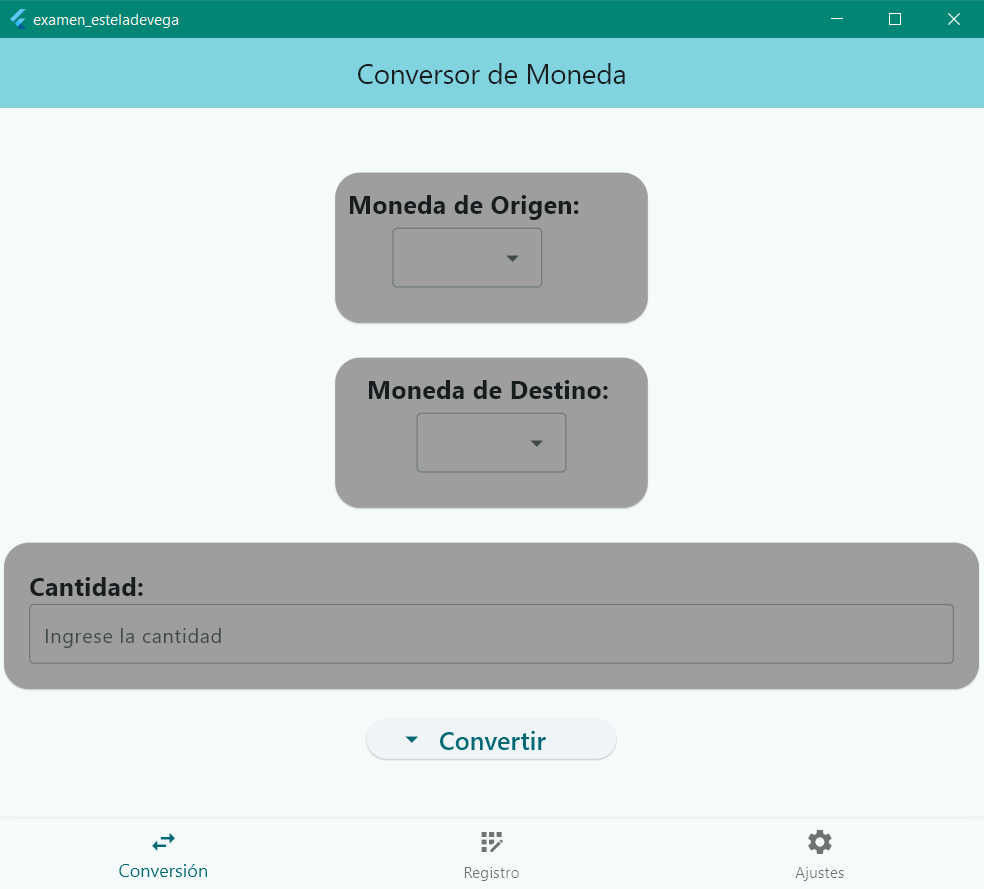
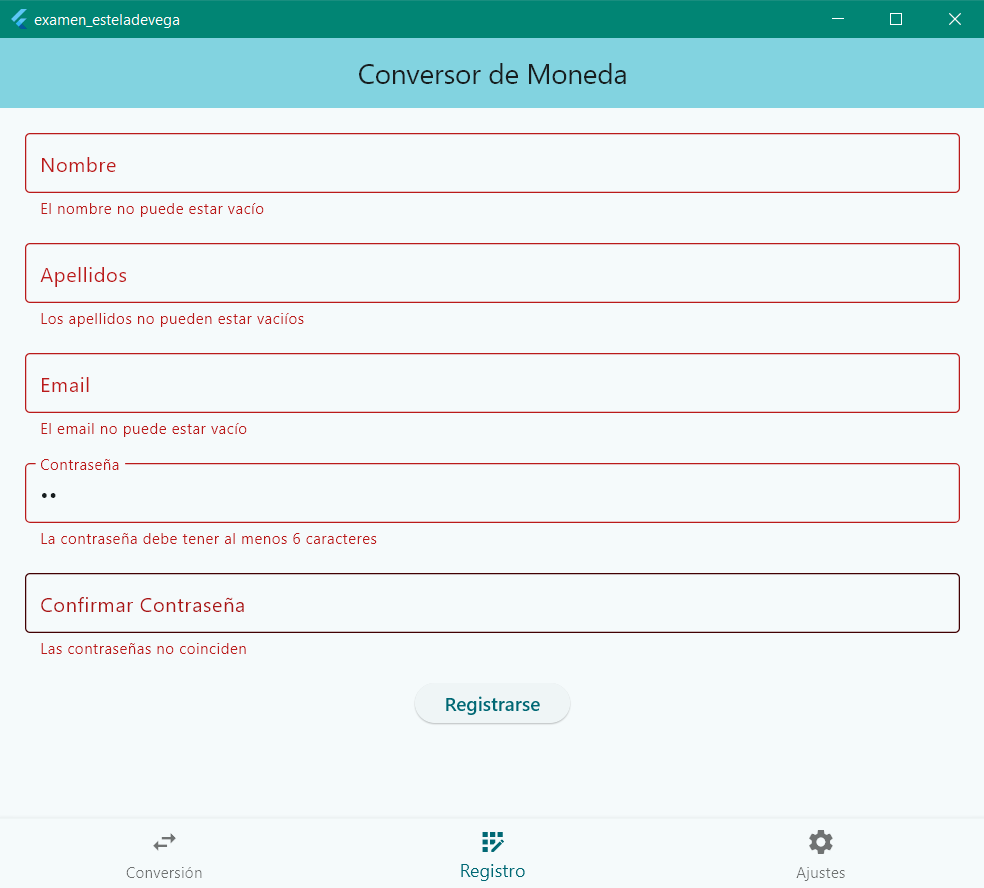
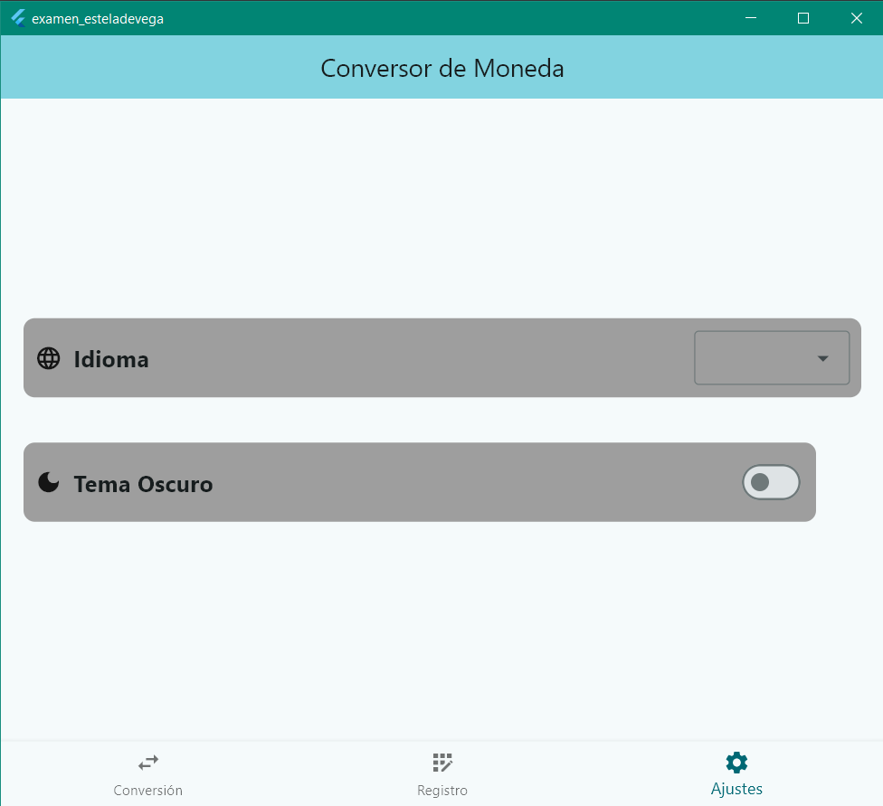

# Enunciado examen Desarrollo de Interfaces: Figma y Flutter
## Parte Figma (5/5 puntos)
Realizar una aplicación en Figma con las siguientes pantallas:
- Inicio sin login.
- Home.
- Perfil genérico.

Declara los estilos o variables locales.
El botón `Sign in` estará enlazado con el feed principal. Al hacer click en el perfil de una publicación irá al perfil genérico.
Usar la microinteracción para cambiar el botón de `seguido` a `siguiendo`.

## Parte Flutter (2.5/5 puntos)
Realizar una <a href="https://github.com/estelaV9/DesarrolloInterfaces/tree/master/Examen_1Evaluacion/examen_esteladevega">aplicación</a> con las siguientes vistas:
<table>
  <tr>
    <th>Vista conversor (0.25)</th>
    <th>Vista Formulario (1.25)</th>
    <th>Vista Ajustes (1)</th>
  </tr>
  <tr>
    <td>
      
    </td>
    <td>
      
    </td>
    <td>
      
    </td>
  </tr>
</table>

  
<table>
  <tr>
    <th>Nota</th>
  </tr>
  <tr>
    <td>7.5</td>
  </tr>
</table>

---
>_Estela de Vega | IES Ribera de Castilla_
