# Proyecto T1: Wireframe en Figma
## Introducción
Realizar en Figma un <a href="https://www.figma.com/design/PizvLATau8znIQ6XHmyI3y/Untitled?node-id=0-1&t=8DXSSS3pJ802P5Nv-1">wireframe</a> de una aplicación que conozcas que implemente:
- `Menú de hamburguesa`.
- `Pestañas`.
- `Navegación inferior`.
- `Elementos interactivos`.

Y además utilice 3 de los siguientes patrones:
- `Deslizar para acciones`.
- `Drag and Drop`.
- `Tarjetas`.
- `Sistema de cuadrícula`.
- `Microinteracciones`.
- `Divulgación progresiva`.
- `Pantallas divididas`.
  
El proyecto de Figma debe tener:
- Definidos los estilos como variables locales.
- Definidos como componentes y variantes los componentes reutilizables en una página individual.
- Utilizado los estilos locales en los diferentes elementos.

## Proyecto BankPal
Se ha realizado un **wireframe** sobre una aplicaciónn de banco, inspirado en el diseño del ejercicio de <a href="https://github.com/estelaV9/PMDM/tree/master/introduccion">cuentas bancarias</a> 
del módulo de **PMDM**.

### Visión General del Proyecto
#### Introducción
<table>
  <tr>
    <td width="44%">
      Al abrir el proyecto, aparecerá una introducción de tres páginas sobre la aplicación <b>BankPal</b>.   
      Después de deslizar la intruducción, mostrará la introducción principal donde redirigira al usuario a la aplicación pulsando el botón <b>START</b>.
    </td>
    <td width="45%">
       
       
       
       
    </td>            
 </tr>
</table>

#### Página Principal
<table>
  <tr>
    <td width="45%">
      Cuando se acceda a la aplicación pulsando el botón <b>START</b>, mostrará las opciones del <b>Home</b> que se dividirá en:
      <ol>
        <li><b>History</b>: mostrará el historial de compras realizadas</li>
        <li><b>Statistics</b>: mostrará las estadísticas de gastos e ingresos. Cuando se pulse en un icono del círculo aparecerá un desplegable con la información de ese gasto o ingreso.</li>
      </ol>
    </td>            
   </tr>
  <tr>
    <td width="44%">
        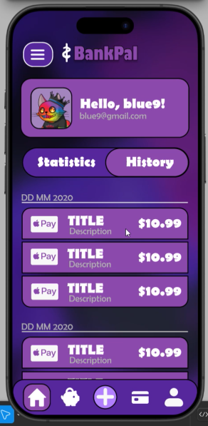 
         
        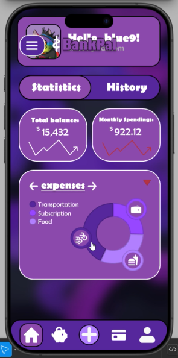 
        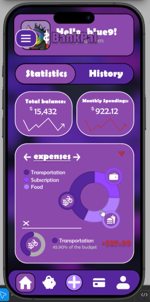 
        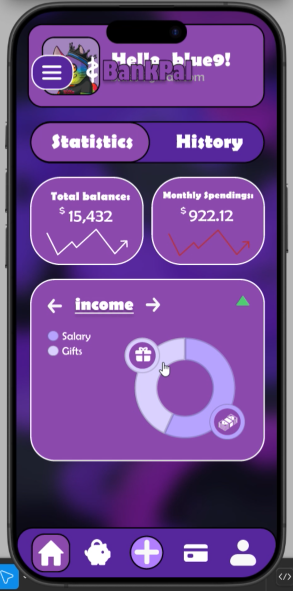 
        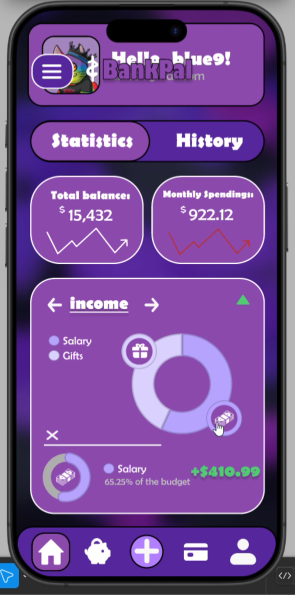 
    </td>
  </tr>
</table>

#### Página de Categorías
<table>
  <tr>
    <td width="35%">
      En la opción de <b>categorias</b> se mostrará todas las categorias que hay creadas.   
      Se podrá <b>crear</b>, <b>modificar</b> o <b>eliminar</b> una categoria dependiendo si es un gasto o un ingreso.
    </td>
    <td width="65%">
      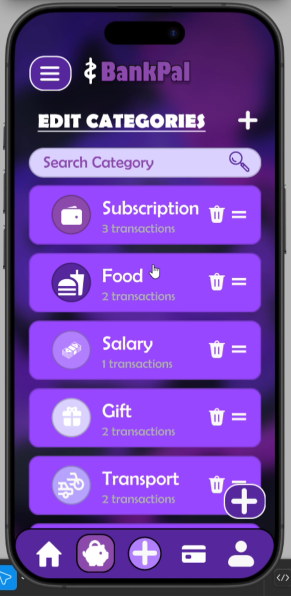 
      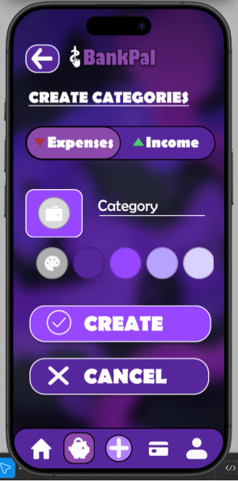 
      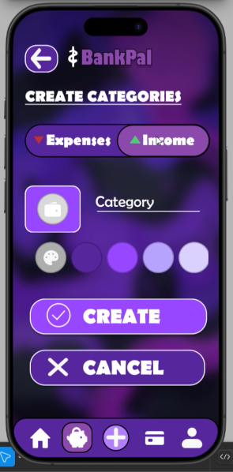 
      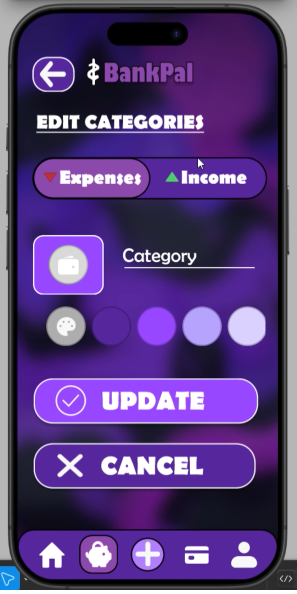 
      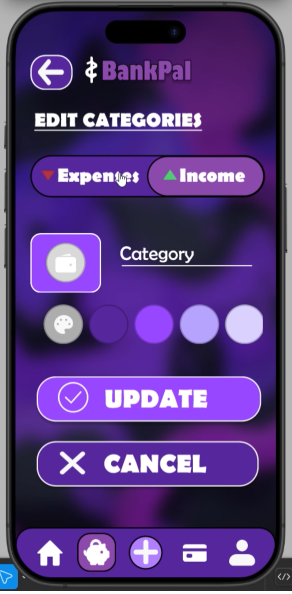 
      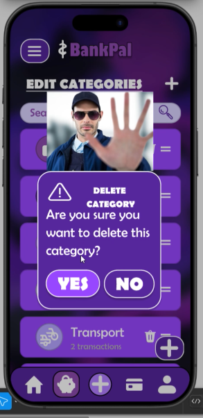 
    </td>            
 </tr>
</table>

#### Página de Transferencias
- **Enviar dinero**.
<table>
    <tr>
    <td width="45%">
      En la opción de <b>enviar dinero</b> se podrá enviar dinero a un contacto existente o a un nuevo número. Se elegirá la tarjeta de donde se quiera quitar el dinero, se introducirá la cantidad y se enviará.   
      Si quiere hacer una nueva transacción mientras está haciendo el formulario de la transferencia saltará una alerta de si quiere cancelar la transacción.
    </td>
  </tr>
  <tr>
    <td width="55%">
      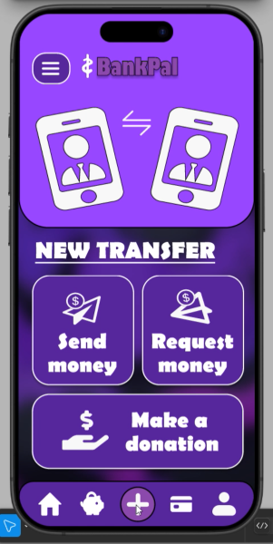 
      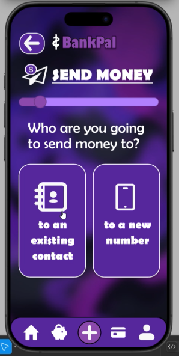 
      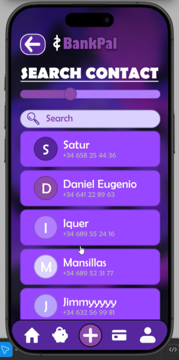 
       
      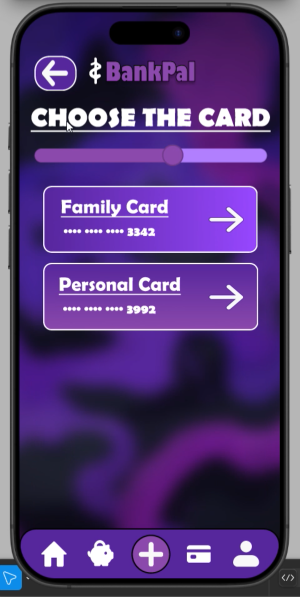 
      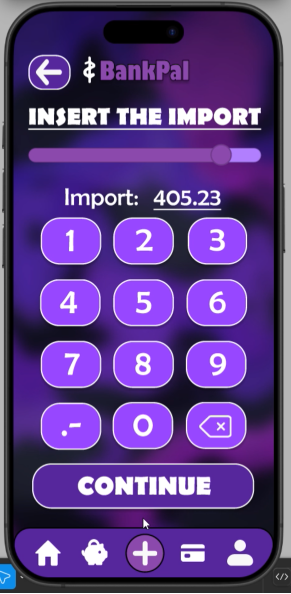 
      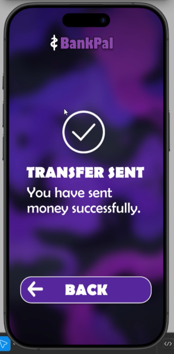 
      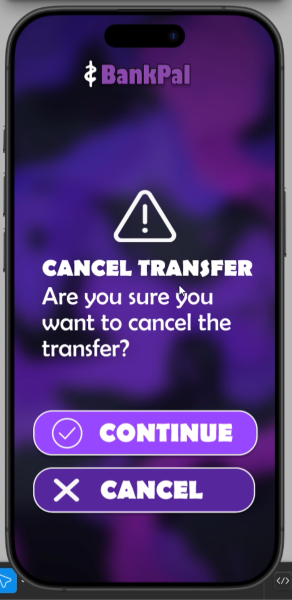 
    </td> 
  </tr>
</table>
  
- **Recibir dinero**.
<table>
  <tr>
    <td width="45%">
      En la opción de <b>recibir dinero</b> se podrá recibir dinero de un contacto existente o un nuevo número. Se elegirá el importe y quién se lo enviará, se elegirá la tarjeta de donde se quiera recibir el dinero y se enviará.   
      Si quiere hacer una nueva transacción mientras está haciendo el formulario de la transferencia saltará una alerta de si quiere cancelar la transacción.
    </td>
  </tr>
  <tr>
    <td width="55%">
      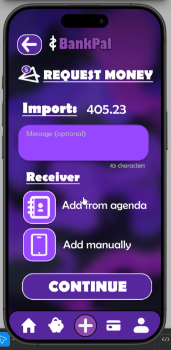
      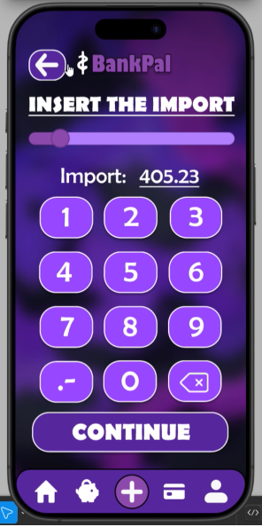 
      
       
       
      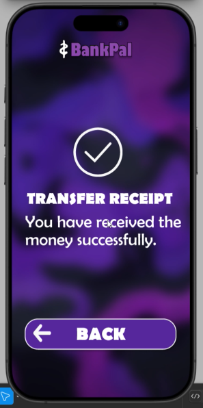 
       
    </td> 
  </tr>
</table>
  
- **Hacer una donación**.
<table>
    <tr>
    <td width="45%">
      En la opción de <b>hacer una donación</b> se podrá enviar dinero a un ong existente. Se elegirá la tarjeta de donde se quiera quitar el dinero, se introducirá la cantidad y se enviará.   
      Si quiere hacer una nueva transacción mientras está haciendo el formulario de la transferencia saltará una alerta de si quiere cancelar la transacción.
    </td>
  </tr>
  <tr>
    <td width="55%">
      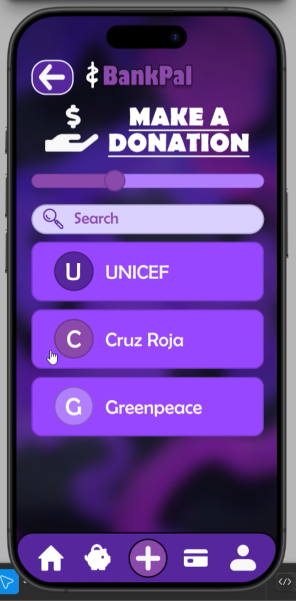 
       
       
      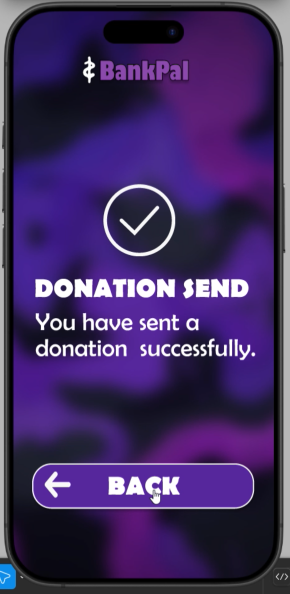 
       
    </td> 
  </tr>
</table>

#### Página de Tarjetas
<table>
  <tr>
    <td width="60%">
      En la opción de <b>tarjetas</b> se visualizará las tarjetas que tiene el usuario.   
      Se podrá <b>crear</b>, <b>modificar</b> o <b>ver</b> las tarjetas.
    </td>
    <td width="40%">
      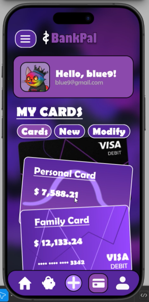 
      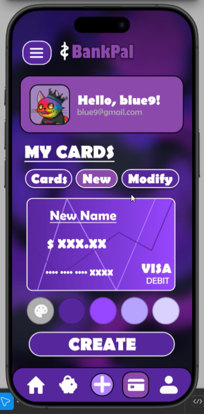 
      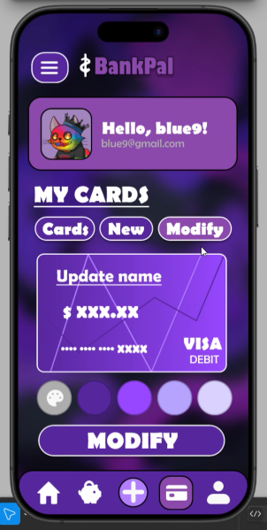 
    </td>            
 </tr>
</table>

#### Página de Pefil
<table>
  <tr>
    <td width="55%">
      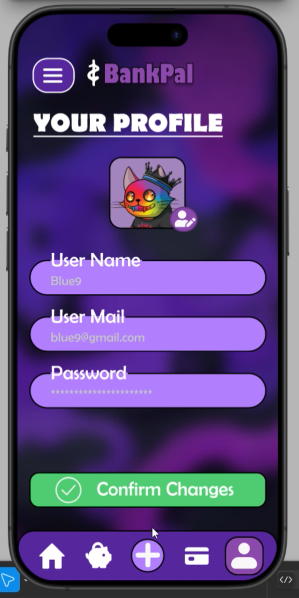 
      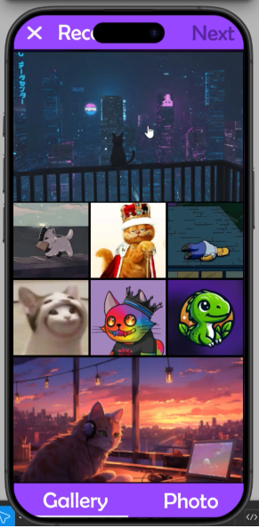 
      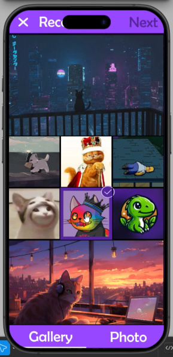 
      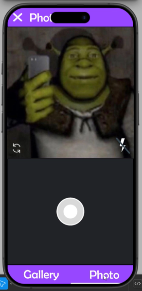 
      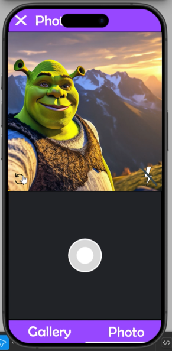 
    </td> 
    <td width="45%">
      En la opción de <b>perfil</b> se podrá modificar los datos relacionados al perfil del usuario. Como los datos o la foto de perfil.   
      Se podrá <b>elegir</b> una foto de galeria, selecciando la foto y dando a <b>next</b> o <b>hacer</b> una foto con la cámara frontal o la trasera.
    </td>
 </tr>
</table>

#### Menú
<table>
  <tr>
    <td width="70%">
        Al pulsar el botón de <b>tres rayas</b> nos llevará al menú.   
      En él, podremos <b>activar notificaciones</b>, <b>hacer un backup</b>, <b>cerrar la sesión</b>, <b>ir al perfil</b> e <b>ir a mi GitHub</b>
    </td>
    <td width="30%">
       
       
    </td>            
 </tr>
</table>

### Vídeo
Realizar un vídeo demostrativo de la funcionalidad del proyecto.

## Nota
<table>
  <tr>
    <th>
      Nota
    </th>
  </tr>
  <tr>
    <td>10/10. Está todo perfecto, muchísimo curro</td>
  </tr>
</table>

---

  <h2>¡Disfruta del Proyecto!</h2>

>_IES Ribera de Castilla 24/25._
