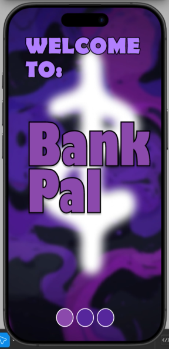
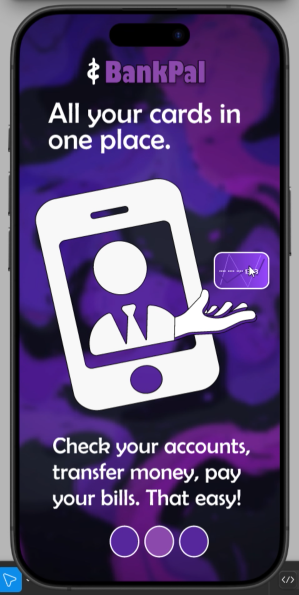
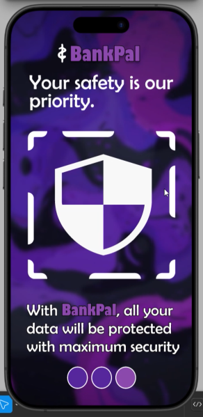
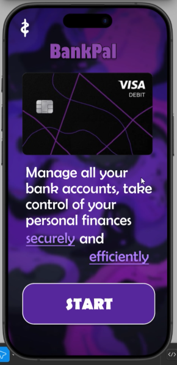
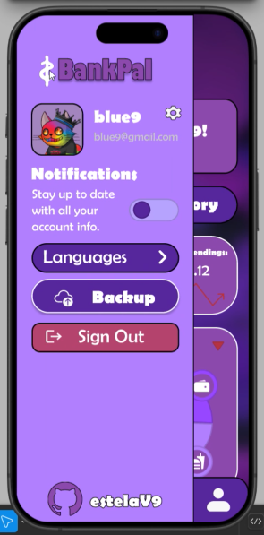
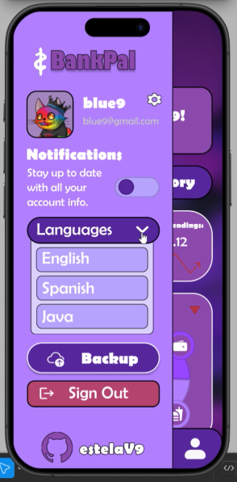

# Proyecto T1: Wireframe en Figma
## Introducción
Realizar en Figma un <a href="https://www.figma.com/design/PizvLATau8znIQ6XHmyI3y/Untitled?node-id=0-1&t=8DXSSS3pJ802P5Nv-1">wireframe</a> de una aplicación que conozcas que implemente:
- `Menú de hamburguesa`.
- `Pestañas`.
- `Navegación inferior`.
- `Elementos interactivos`.

Y además utilice 3 de los siguientes patrones:
- `Deslizar para acciones`.
- `Drag and Drop`.
- `Tarjetas`.
- `Sistema de cuadrícula`.
- `Microinteracciones`.
- `Divulgación progresiva`.
- `Pantallas divididas`.
  
El proyecto de Figma debe tener:
- Definidos los estilos como variables locales.
- Definidos como componentes y variantes los componentes reutilizables en una página individual.
- Utilizado los estilos locales en los diferentes elementos.

## Proyecto BankPal
Se ha realizado un **wireframe** sobre una aplicaciónn de banco, inspirado en el diseño del ejercicio de <a href="https://github.com/estelaV9/PMDM/tree/master/introduccion">cuentas bancarias</a> 
del módulo de **PMDM**.

### Visión General del Proyecto
#### Introducción
<table>
  <tr>
    <td width="45%">
        Al abrir el proyecto, aparecerá una introducción de tres páginas sobre la aplicación <b>BankPal</b>.   
      Después de deslizar la intruducción, mostrará la introducción principal donde redirigira al usuario a la aplicación pulsando el botón <b>START</b>.
    </td>
    <td width="55%">
       
       
       
       
    </td>            
 </tr>
</table>

#### Página Principal

#### Página de Categorías

#### Página de Transferencias

#### Página de Tarjetas

#### Página de Pefil

#### Menú
<table>
  <tr>
    <td width="70%">
        Al pulsar el botón de <b>tres rayas</b> nos llevará al menú.   
      En él, podremos <b>activar notificaciones</b>, <b>hacer un backup</b>, <b>cerrar la sesión</b>, <b>ir al perfil</b> e <b>ir a mi GitHub</b>
    </td>
    <td width="30%">
       
       
    </td>            
 </tr>
</table>

### Vídeo
Realizar un vídeo demostrativo de la funcionalidad del proyecto.

---

  <h2>¡Disfruta del Proyecto!</h2>

>_IES Ribera de Castilla 24/25._
